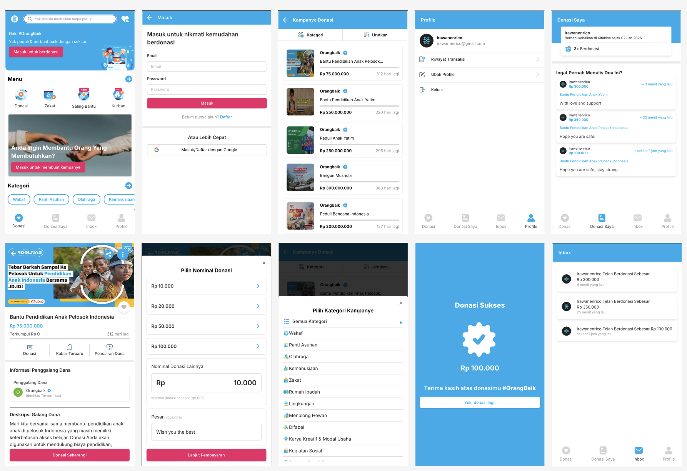

# KitaBisa.com Frontend Clone App
The KitaBisa.com Backend Clone App is a crowdfunding application that allows users to create fundraising campaigns and collect donations from a wide range of contributors.

This application provides a backend system to manage user authentication, campaign creation, and donation processing securely and efficiently.


## Features
User registration,
Email-based login,
Google account authentication,
Create and manage campaigns &
Donate to campaigns

## Backend Tech Stack
NextJs – Backend framework

NextAuth & HttpOnly Cookies

WebSocket - real-time communication

React Query - server-state management

Zustand - client-state management

React Hook Form with Zod - form validation

ShadCN UI and Tailwind CSS - UI styling
## How to run project locally

To run kitabisa-backend project with npm

```bash
  git clone https://github.com/enricoirawan/kitabisa-frontend
```

then install 

```bash
  npm install
```

run the project on development enviroment
```bash
  npm run dev
```
## Environment Variables

To run this project, you will need to add the following environment variables to your .env file

`NEXTAUTH_URL`

`GOOGLE_CLIENT_ID`

`GOOGLE_CLIENT_SECRET`

`NEXTAUTH_SECRET`

`NEXT_PUBLIC_BACKEND_URL`

`DOMAIN_COOKIE`
## Frontend Repo
https://github.com/enricoirawan/kitabisa-backend

